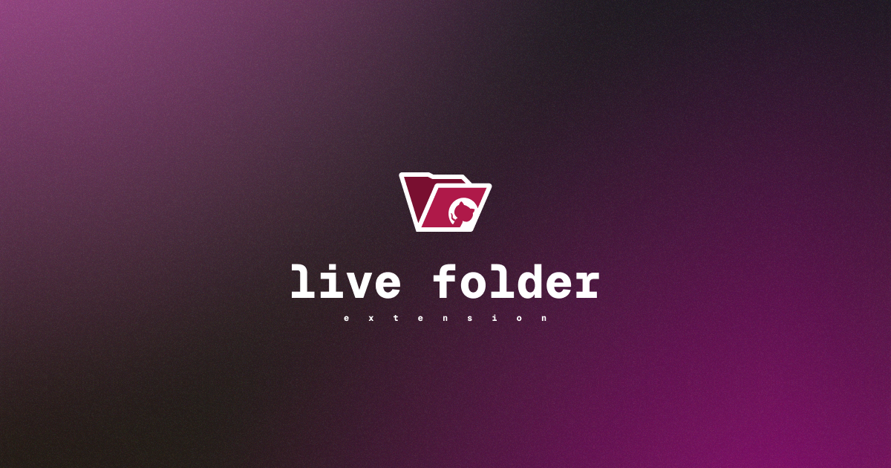

Track your github pull requests automatically and have them ready for review in your browser's bookmarks.

The extension checks browser cookies for the github.com domain, if the user is logged int, it will automatically check user's pull requqests list and store them in the bookmarks folder, refreshing the list periodically.

You can customize the folder's name, pull request's title format, and interval between refreshes.

## Build

Build for Firefox:
```bash
bun install
bun run zip:firefox
```

Build for Chrome:
```bash
bun install
bun run zip
```

## Development

Run the development server:
```bash
bun install
bun run dev
```

Run the development server for Firefox:
```bash
bun install
bun run dev:firefox
```

## License

[MIT](https://github.com/s0rus/live-folder/blob/main/LICENSE)

